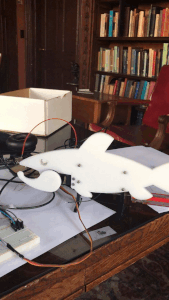
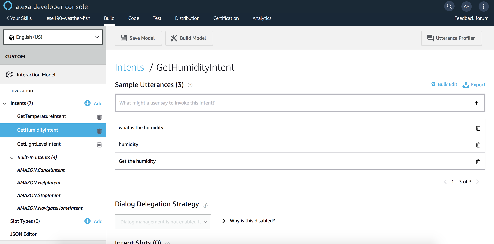
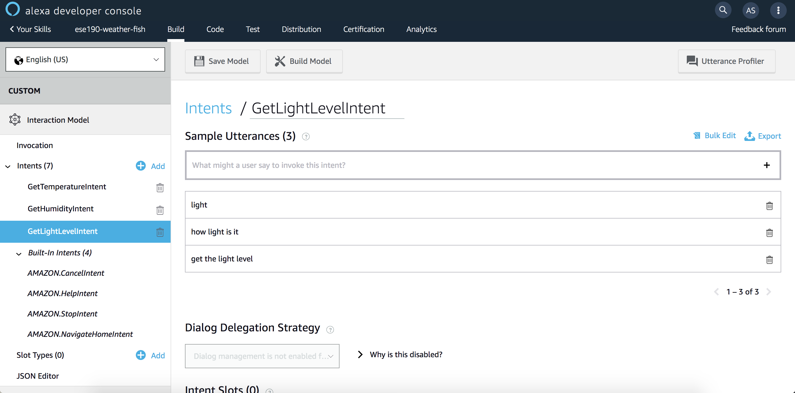
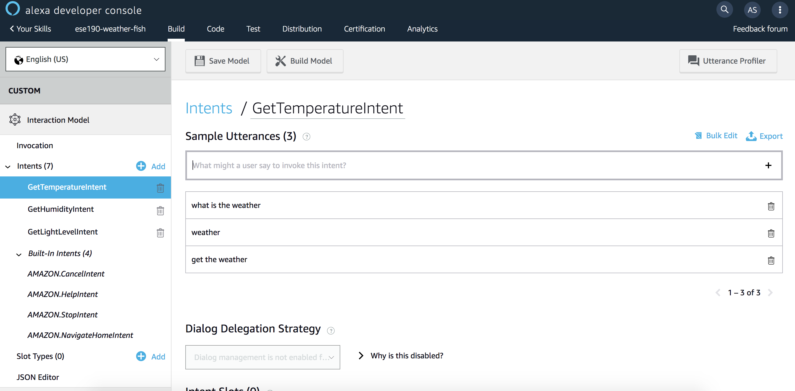

# Amazon Billy Bass Fish Software

This project has 4 components:

1. The Arduino Script `billy-bass-arduino.ino`
2. A serial port reader script `serial-read.py`
3. An Internet of things server
4. Alexa Skill



Going in order:

### Arudino Script

The `billy-bass-arduino.ino` script allows an Arduino Uno to move a servo in response to an audio signal and also read a light sensor and DHT11 sensor. The configuration needed is

* the audio analog signal to be fed into port `A1`
* an LED output to be coming out of PWM port `10`
* a servo to be going out of PWM port `6` 
* a light sensor output being fed into analog port `A5`
* Digital port `2` to be used for the DHT11 sensor output.


### Serial Port Reader

In order to publish data to the IoT Server a request must somehow be made to the IoT server to the `/update` route with the URL query parameters `light`, `humidity`, and `temperature`. E.g. 

```curl
GET ping-tester-ese190.herokuapp.com/update?light=90&humidity=40&temperature=20
```

This can be done either by modifying the Arudino script to include the Ciao library (and using an Arudino Uno Wifi) or by reading off the  values with the `serial-read.py` script.

To use the script, run `python serial-read.py` in a terminal tab. This call will instantiate a running loop that will check for any USB devices connected to your computer (tested on a mac) that contain a substring `cu.usbmodem`. Upon finding such a device, it will read data  published to the Serial channel at baudrate `9600` (ie the sensor values) and publish the values to the IoT server.

### IoT Server

To run the IoT server, run `npm install` followed by `npm start`. The only dependency is express. To test whether data has been published to the server, visit the server getData route (if testing locally this would be `localhost:3000/getData`). The server can be readily deployed to heroku without any additional work. Just run `heroku create` and do `git push heroku master`.

### Alexa Skill

The Alexa skill code is contained within the `Alexa-BBF-Skill` folder. Within the `index.js` script, you will need to edit line 7 to include the appropriate base url for your IoT server. Without doing this step, the skill code would not work. Additionally, the following intents must be created (refer to the screenshots).

**GetHumidityIntent**




**GetLightLevelIntent**



**GetTemperatureIntent**




